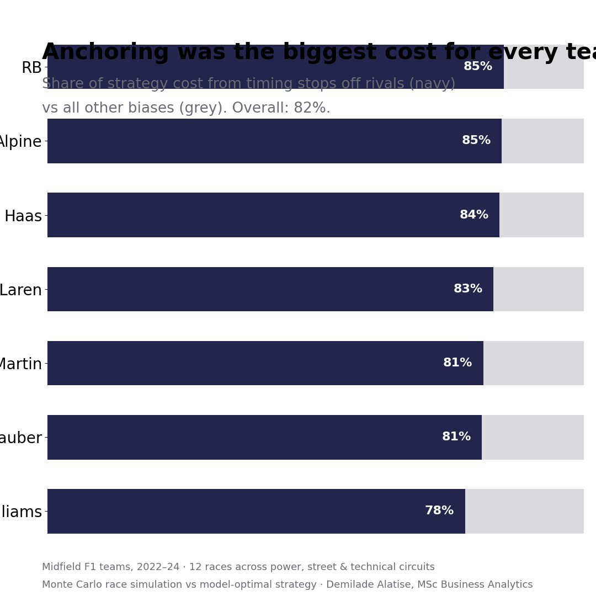

# Strategic Survival in the Ground Effect Era

**Detecting decision bias in midfield Formula 1 pit stop strategy (2022–2024)**

MSc Business Analytics dissertation, Keele University, by Demilade Alatise.

This project asks whether midfield F1 teams make pit stop calls on their own merits, or react to what rivals and race events do. It combines a machine-learning safety car model with a Monte Carlo race simulator, finds the model-optimal strategy for each driver-race, and decomposes the gap between the real decision and the optimum into three named biases.

## Key findings

- **Competitor anchoring was the dominant bias.** It appeared in all 21 of 21 team × circuit-type cells, and 99.2% of identifiable trigger events (1,754 of 1,768) showed it. It accounted for about 82% of total bias cost.
- **Safety car weighting ran the opposite way to the hypothesis.** In 84% of identifiable cases teams *over*weighted safety cars rather than underweighting them. Direction was largely a race-level property, so the effective sample is roughly 8 races, not 81 decisions.
- **Conservatism was real but mixed.** 69% of cases stopped later than optimal; 28% overshot.
- **Bias cost was highest on power circuits** (mean 9.19), then street (6.58), then technical (2.93).



## Scope

- Seasons: 2022–2024 (ground-effect regulations)
- Teams: McLaren, Alpine, Aston Martin, RB/AlphaTauri, Sauber, Haas, Williams
- Races: 12, sampled across three circuit archetypes (power, street, technical)
- Data: FastF1, Ergast, OpenF1 and Weather Underground

## How the pipeline flows

```
Raw lap, pit, weather data
        │
        ▼
Phase 1 – Base dataset          74,536 laps × 55 columns, strategic-stop labels,
                                fuel-corrected tyre degradation
        │
        ▼
Phase 2 – Safety car model      Class-weighted XGBoost with sigmoid calibration,
                                trained ≤2023, tested on 2024
        │
        ▼
Phase 3 – Simulation & bias     Monte Carlo race simulation → optimal strategy per
                                driver-race → bias decomposition → cross-archetype rollup
```

### Phase 1: Base dataset
Fetches and cleans lap, pit and weather data, then engineers features including the `is_strategic_stop` label and fuel-corrected degradation rates.
Main modules: `utils.py`, `features.py`

### Phase 2: Safety car probability model
Predicts the per-lap probability of a safety car or VSC. The final model is class-weighted XGBoost (no SMOTE) calibrated with `CalibratedClassifierCV`, using a temporal split (train 2022–23, test 2024).
Holdout: AUC-ROC 0.718, Brier 0.097.
Main modules: `phase2_features_a/b/c.py`, `phase2_model.py`

### Phase 3: Simulation and bias decomposition
For each driver-race, the simulator samples safety car events from the Phase 2 model, simulates candidate strategies, and finds the optimum. The real decision is compared against it and the shortfall is split into conservatism, anchoring, safety car weighting and an unattributed residual.
Main modules (`simulation/`):

| Module | Role |
|---|---|
| `config.py` | Constants and thresholds |
| `race_state.py` | Per-race inputs and prediction provenance |
| `sc_sampler.py` | Samples safety car events from model probabilities |
| `race_model.py`, `race_model_vectorized.py` | Lap-by-lap race time model (vectorized version for speed) |
| `strategy.py`, `optimiser.py` | Candidate strategies and optimal search |
| `monte_carlo.py` | Runs simulations |
| `references.py` | Builds reference outcomes |
| `bias.py` | Decomposes deviation into the three biases |
| `rollup.py` | Aggregates by team and archetype |
| `run.py` | Entry point for the Phase 3 run |

## Repository structure

```
data/              raw and processed data (CSVs are regenerated, not committed)
source_code/       pipeline source code (Phases 1–3)
diagnostics/       diagnostic outputs and checks
notebooks/         exploratory analysis
figures/           output charts
tests/             unit tests
docs/              development and robustness notes
archive/           superseded scripts kept for the audit trail
fetch_f1_data.py   raw data fetch via FastF1
```

## How to reproduce

```bash
pip install -r requirements.txt
# Fetch raw data
python fetch_f1_data.py
# Phase 1 – build the base dataset (run the full sequence, not single build_ functions)
python -m source_code.features
# Phase 2 – train and calibrate the safety car model
python -m source_code.phase2_model
# Phase 3 – simulate and decompose bias
python -m source_code.simulation.run
```

A full Phase 3 recompute (12 races, 10,000 iterations, 4 workers) takes about 28 minutes.

## Limitations

- Safety car discrimination is near-random on street circuits (AUC ≈ 0.54), so safety car weighting cannot be identified there.
- Seven of the 12 races use out-of-fold predictions (AUC 0.648) rather than the 2024 holdout.
- The conservatism measure only covers first pit stop timing.
- Two simulations are over-confident: Italian GP 2024 (predicted a Piastri win; Leclerc won, with thin Monza soft-tyre data) and Miami GP 2024 (correct winner, but certainty overstated).

Development and robustness notes: [`docs/dev_notes.md`](docs/dev_notes.md)
